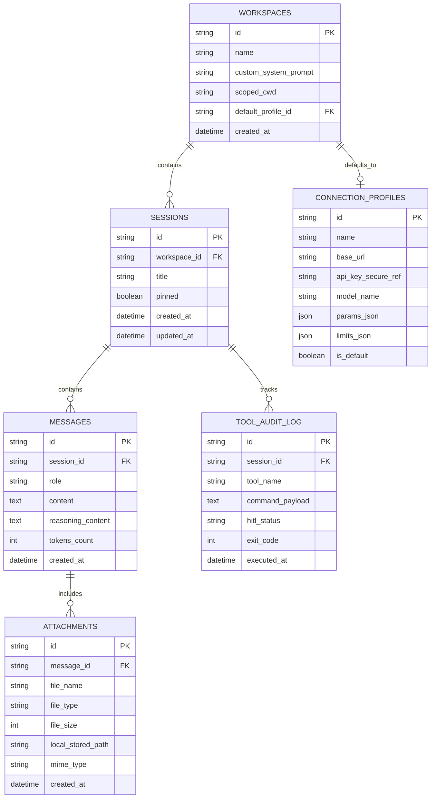

# SQLite Database Schema & Persistence Model

## Overview
The application follows a **local-first, offline-capable** persistence strategy. In native desktop (Windows) and mobile (Android), data is stored in a local SQLite database managed by the Tauri Rust backend. In standalone Web mode, it falls back to IndexedDB.

## Entity Relationship Diagram

## Tables Specification

### 1. `workspaces`
Groups projects, custom system instructions, and scoped working directory (`scoped_cwd`) for local tool execution.

### 2. `sessions`
Represents an individual conversational thread, ordered chronologically (*Today*, *Yesterday*, *Older*) and filterable by workspace.

### 3. `messages`
Stores multi-turn messages with distinct roles (`user`, `assistant`, `system`, `tool`). Captures separate `reasoning_content` for Hermes `<thought>` tags and token metrics.

### 4. `attachments`
Tracks files copied to the app's internal sandbox storage (`%APPDATA%/hermes-chat-app/media/`), ensuring links remain valid if original files are moved.

### 5. `connection_profiles`
Manages endpoints for different Hermes instances, API keys (via OS credential manager when available), inference parameters, and payload limits.

### 6. `tool_audit_log`
Immutable audit log recording every tool invocation requested by Hermes, the parameters, the user's HITL response (`authorized` or `denied`), and the exit code.

## Related Concepts
- [System Topology](system-topology.md)
- [HITL Tool Execution](../specs/hitl-tool-execution.md)
- [Multimodal Audio Pipeline](../specs/multimodal-audio-pipeline.md)
