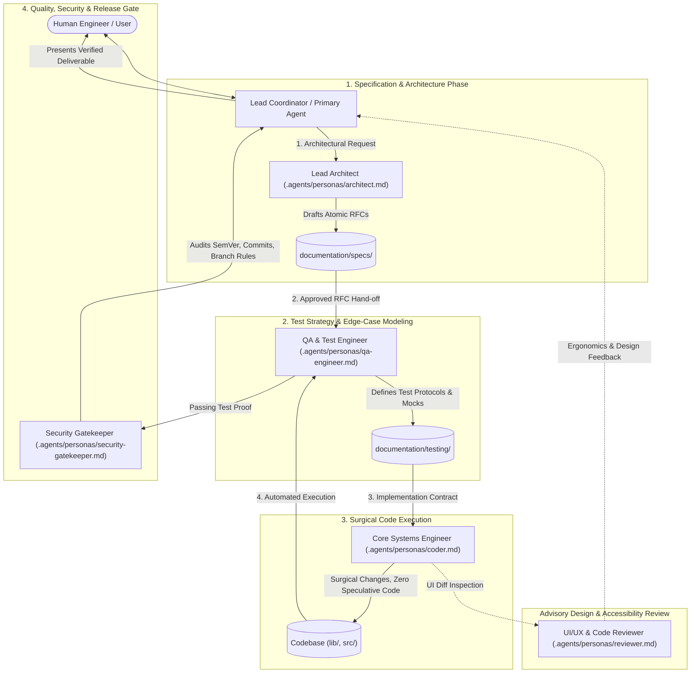

# Multi-Agent Personas Architecture & Collaboration Topology

## 1. Executive Summary & Purpose

The **Hermes Chat App** is engineered through an agentic pair-programming model where distinct AI agent personas fulfill specialized roles across the software development lifecycle. Rather than relying on a single, monolithic prompt that risks context bloat and degraded reasoning, the project decomposes developer responsibilities into discrete, specialized agent personas.

This architecture formalizes:
1. **Specialized Archetypes:** Dedicated personas for architecture, surgical coding, automated verification, security governance, and UI/UX review.
2. **Context Efficiency ("LLM-Wiki" Pattern):** Minimizing context window saturation by sharing state through atomic Google OKF specifications rather than verbose chat logs.
3. **Cross-Tool Interoperability:** A vendor-neutral persona configuration compatible across Google Antigravity, Anthropic Claude Code / Claude Desktop, OpenCode, and external AI agents.

---

## 2. Collaboration Topology & Lifecycle Handoffs

The multi-agent team operates on a **Hub-and-Spoke (Coordinator-Specialist)** model governed by Karpathy's simplicity principles and strict verification-first delivery:

---

## 3. Persona Matrix & Operational Boundaries

| Persona ID | Role Title | Recommended Model | Primary Scope | Operational Boundaries |
| :--- | :--- | :--- | :--- | :--- |
| `persona-architect` | **Lead Architect & RFC Specifier** | `pro` | System topology, RFCs, Google OKF documentation | Restricted to `documentation/`. No production code edits. |
| `persona-coder` | **Core Systems Engineer** | `inherit` / high-speed | Feature implementation, bug fixes | Surgical diffs only. No unapproved architectural abstractions. |
| `persona-qa-engineer` | **Quality & Test Automation Engineer** | `inherit` | Unit tests, integration tests, SSE mocks | Scoped to `test/` and `documentation/testing/`. Reproduce defects before fixing. |
| `persona-security-gatekeeper` | **Security, Governance & Release Overseer** | `inherit` | Git hygiene, SemVer, Conventional Commits, secrets | Read/audit tools. Strictly blocks direct pushes to `main` and autonomous commits. |
| `persona-reviewer` | **UI/UX & Code Reviewer** | `inherit` | Layout matrix, design tokens, latency UX, PR reviews | Read-only advisory role. Inspects cross-platform visual parity. |

---

## 4. Inter-Agent Communication & State Sharing Patterns

### A. Shared Knowledge Graph (Single Source of Truth)
Instead of passing sprawling conversational histories between agents, subagents synchronize state through atomic documentation files conforming to Google OKF:
* Architecture and protocols live in [`documentation/specs/`](../specs/spec-001-hermes-chat-core.md).
* Testing criteria live in [`documentation/testing/`](../testing/quality-and-testing-strategy.md).
* Audit history lives in [`documentation/log.md`](../log.md).

### B. Point-to-Point Messaging (`send_message`)
In environments supporting direct messaging (e.g., Antigravity), agents communicate asynchronously using distinct conversation IDs:
* The coordinator delegates specific sub-tasks to workers.
* Workers report completion, structured test outputs, or blockers back to the coordinator without polling loops.

### C. Workspace Isolation
Subagents performing risky or experimental modifications utilize isolated workspaces (`Workspace: branch` or `Workspace: share`):
* Allows testing alternative implementations without polluting the primary working tree.
* Merged into the active branch only upon complete verification.

---

## 5. Cross-Tool Integration Strategy

### Google Antigravity
* **Subagent Invocation:** Dynamic creation via `define_subagent` and `invoke_subagent` configured with model tier, system prompt, and tool toggles matching the persona definition.
* **Progressive Disclosure (Skills):** Specialized workflows (such as `google-okf`) are discovered automatically when relevant tasks are triggered.
* **Lifecycle Hooks:** Automated pre-tool or post-tool execution hooks defined in `hooks.json` for deterministic checks (e.g., verifying American English and branch safety).

### Claude Code (CLI) & Claude Desktop
* **Rule Ingestion:** [CLAUDE.md](../../CLAUDE.md) points to `.agents/personas/` for role switching.
* **Task Delegation:** Claude Code CLI delegates file search and isolated exploration tasks to sub-processes to conserve context tokens.
* **Claude Desktop Projects:** Project Custom Instructions and MCP servers (filesystem, SQLite) constrain tool access per session.

### OpenCode & Open-Source Agent Frameworks
* **Direct System Prompt Loading:** Frameworks like OpenHands or Aider can directly ingest `.agents/personas/<role>.md` as standard system prompts.
* **Coordinator-Worker Event Streams:** Framework state machines trigger the Architect on planning events, Coder on code events, and QA on execution events.

---

## 6. Semantic Cross-References

- **[Project Guidelines (AGENTS.md)](../../AGENTS.md)**: Repository rules, Karpathy principles, American English mandate.
- **[Persona Definitions Directory](../../.agents/personas/README.md)**: Individual persona specification files.
- **[Knowledge Catalog (index.md)](../index.md)**: Root catalog of all project specifications and concepts.
- **[Audit Log (log.md)](../log.md)**: Chronological history of knowledge base updates.
