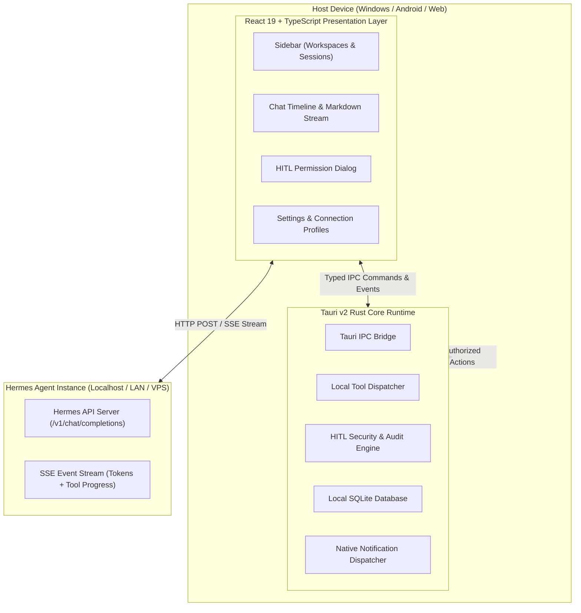

# System Topology & Multiplatform Architecture

## Overview
The **Hermes Chat App** is engineered as a hybrid, multiplatform application interfacing with Nous Research's **`hermes-agent`**. It operates across Windows, Android, and Web using a single shared codebase.

## Layer Responsibilities

### 1. Presentation Layer (React 19 + TypeScript + Vite + Tailwind CSS)
- Renders responsive conversational UI, streaming text, syntax-highlighted code, LaTeX math, and audio visualizers.
- Decouples active chat view from background network streams to support multi-session streaming.

### 2. Native Core Runtime (Tauri v2 in Rust)
- Manages operating system boundaries, process execution, and filesystem I/O.
- Enforces Human-In-The-Loop (HITL) authorization rules and maintains an immutable tool execution audit log.
- Embeds a local-first SQLite persistence engine.
- Exposes typed Rust commands to frontend via Tauri IPC.

### 3. Agent Backend (Nous Research `hermes-agent`)
- External server instance running locally (`localhost:8000`), on local network, or remote VPS/cloud.
- Emits Server-Sent Events (SSE) including text deltas, reasoning blocks, and tool calls.

## Related Concepts
- [Data Model](data-model.md)
- [SSE Streaming Protocol](../specs/sse-streaming-protocol.md)
- [HITL Tool Execution](../specs/hitl-tool-execution.md)
