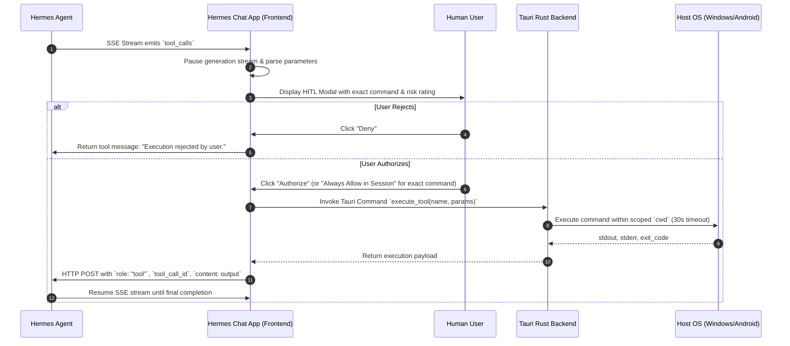

# Split-Runtime Human-In-The-Loop (HITL) Tool Execution

## Overview
Hermes Agent supports split-runtime execution where the agent's LLM reasoning operates remotely, but system-level tool invocations (shell commands, file reads/writes) are dispatched to the client device. To safeguard the host, every tool call is gated by a strict **Human-In-The-Loop (HITL)** security mechanism.

## Tool Execution Lifecycle

## Security Guardrails

1. **Scoped Working Directory (`cwd`):** Tools execute in the workspace's configured directory or the isolated app sandbox (`%APPDATA%/hermes-chat-app/workspaces/<project-id>/`).
2. **Granular Session Scope:** "Always Allow in Session" grants authorization **only** to that exact command string and arguments, preventing silent escalation to other commands.
3. **Execution Timeout:** Non-interactive execution is enforced with a configurable 30-second default timeout and an interactive `[Abort / Cancel]` button in the UI.
4. **Audit Trail:** Every invocation (authorized, denied, timed out) is permanently recorded in [`tool_audit_log`](../architecture/data-model.md).

## Supported Tools Matrix by Platform
| Tool Identifier | Description | Windows | Android | Web |
| :--- | :--- | :---: | :---: | :---: |
| `run_shell_command` | Execute PowerShell/CMD commands | Full | Disabled | Emulated |
| `read_file` | Read local file content | Full | App Sandbox Storage | File Picker |
| `write_file` | Write content to local file | Full | App Sandbox Storage | Download Trigger |
| `list_directory` | List contents of a directory | Full | App Sandbox Storage | Disabled |
| `get_system_info` | OS, CPU, Memory, Architecture | Full | Device Info API | Navigator API |

## Related Concepts
- [System Topology](../architecture/system-topology.md)
- [Data Model](../architecture/data-model.md)
- [Notification Engine](notification-engine.md)
