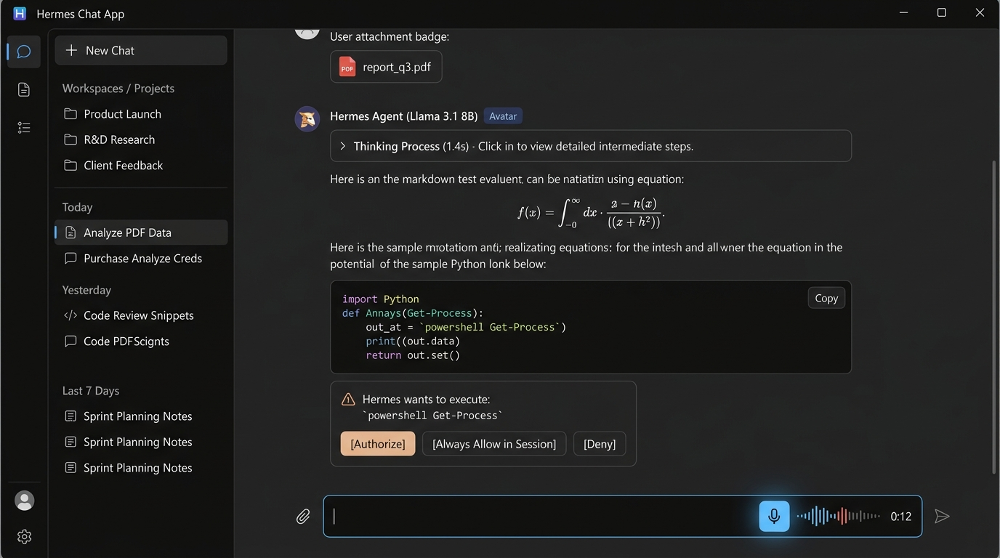
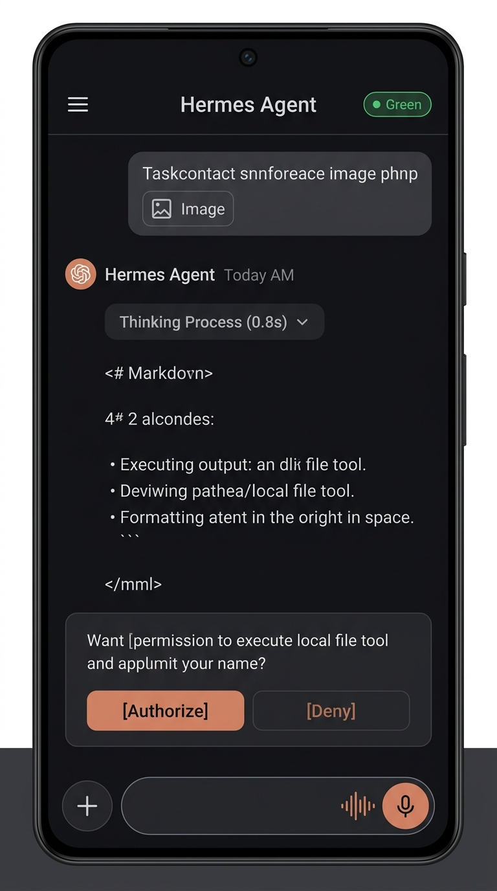

# Responsive Layout Matrix & Visual Design System

## Overview
The application adheres to a strict responsive, multiplatform design system built with Tailwind CSS, supporting Windows desktop, Android mobile, and Web browsers.

## Responsive Breakpoint Strategy

```
+-------------------------------------------------------------------------+
| Desktop Layout (Windows / Large Web >= 1024px)                          |
| +--------------------+------------------------------------------------+ |
| | Sidebar (Fixed/    | Top Bar (Profile status, model badge)          | |
| | Collapsible)       | +--------------------------------------------+ | |
| | - Projects         | | Chat Stream Canvas (Centered max-w-4xl)    | | |
| | - Sessions         | | - Messages, Thinking, HITL Cards           | | |
| | - Settings         | +--------------------------------------------+ | |
| |                    | Input Bar (Multiline, Mic Waveform, Uploads) | | |
| +--------------------+------------------------------------------------+ |
+-------------------------------------------------------------------------+

+-------------------------------------+
| Mobile Layout (Android / < 768px)   |
| [=] Hermes Chat App      [Settings] |
| ----------------------------------- |
| Chat Stream Canvas (Full Width)     |
| - Messages                          |
| - Thinking blocks                   |
| - Inline HITL Card (Full Width)     |
| ----------------------------------- |
| Input Bar (Dynamic Viewport Height) |
| [+] [Input Message...]   [(Mic)] [>]|
| (Sidebar opens as Drawer Overlay)   |
| (HITL Modals open as Bottom Sheets) |
+-------------------------------------+
```

### 1. Desktop (`>= 1024px` / Windows)
- Persistent, resizable sidebar with keyboard shortcut (`Ctrl+B`).
- Chat stream width constrained to `max-w-4xl` for optimal reading ergonomics.
- Centered floating modal dialogs with `Esc` key handling.

### 2. Mobile (`< 768px` / Android)
- Sidebar converts into an off-canvas **Navigation Drawer**.
- HITL confirmation cards and settings convert into swipeable **Bottom Sheets**.
- Uses dynamic viewport height (`100dvh`) to avoid layout jumps when the virtual keyboard appears.
- Touch-friendly tap targets of at least 44x44px.

### 3. Tablets & Foldables (`768px - 1023px`)
- Collapsible mini-rail navigation with icon-only mode.

## Visual Design Mockups
- **Desktop Concept:** [hermes-chat-desktop-mockup.jpg](../assets/mockups/hermes-chat-desktop-mockup.jpg)  
  
- **Mobile Concept:** [hermes-chat-mobile-mockup.jpg](../assets/mockups/hermes-chat-mobile-mockup.jpg)  
  

## Related Concepts
- [System Topology](../architecture/system-topology.md)
- [Multimodal Audio Pipeline](multimodal-audio-pipeline.md)
