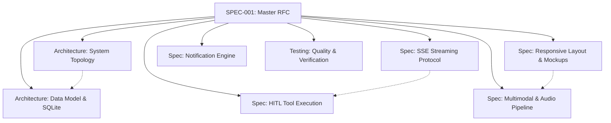

# SPEC-001: Master Specification & Architectural RFC for Hermes Chat App

## 1. Executive Summary

This master specification defines the vision, technical foundation, and modular architecture of the **Hermes Chat App**, a lightweight, high-performance, cross-platform client designed specifically for Nous Research's **`hermes-agent`**.

In accordance with Google's **Open Knowledge Format (OKF)**, detailed technical topics are decomposed into discrete, atomic concept documents linked below.

---

## 2. Core Architectural & Specification Graph

### Atomic Concept Documents:
1. **[System Topology & Multiplatform Architecture](../architecture/system-topology.md):** Hybrid Tauri v2 (Rust) + React 19 + TypeScript + Vite stack.
2. **[Database Schema & Persistence Model](../architecture/data-model.md):** Local SQLite schema for workspaces, sessions, messages, media, profiles, and audit log.
3. **[Hermes SSE Streaming Protocol](../specs/sse-streaming-protocol.md):** Real-time token streaming, `<thought>` block handling, progress events, and network resilience.
4. **[Split-Runtime HITL Tool Execution](../specs/hitl-tool-execution.md):** Human-in-the-Loop security gate, scoped CWD, 30s timeouts, and tools matrix.
5. **[Multimodal & Bidirectional Audio Pipeline](../specs/multimodal-audio-pipeline.md):** Sandboxed media copying, size limits, and Push-to-Toggle voice recording with visualizer.
6. **[Responsive Layout Matrix & Visual Mockups](../specs/responsive-layout.md):** Adaptive Desktop (Windows/Web) and Mobile (Android) drawer/bottom-sheet strategy with visual mockups.
7. **[Cross-Platform Notification Engine](../specs/notification-engine.md):** Windows Action Center, Android System Notifications, and Hermes Cron alarm support.
8. **[Quality Assurance & Testing Strategy](../testing/quality-and-testing-strategy.md):** Automated Vitest unit tests, Rust cargo tests, mock Hermes SSE server, and Definition of Done.

---

## 3. Master Acceptance Criteria (Definition of Done)

Phase 1 delivery is complete when:
1. [ ] **Multiplatform Build:** The project builds cleanly as a native Windows desktop app via Tauri v2 and as a Web SPA.
2. [ ] **Responsive Chat UI:** Functional sidebar with workspaces/sessions, token streaming timeline, and adaptive layout across desktop and mobile viewports.
3. [ ] **Hermes SSE Integration:** Full support for streaming text chunks, reasoning `<thought>` blocks, and status updates.
4. [ ] **HITL Local Tools:** Intercepts local tool requests from Hermes on Windows, prompts the user via modal, executes safely via Rust upon authorization, and returns output.
5. [ ] **Multimodal Attachments:** File uploads are copied to internal app storage and transmitted as base64 payloads to Hermes.
6. [ ] **Voice Capture:** Push-to-toggle audio recording with live waveform visualizer and audio transmission to Hermes.
7. [ ] **Local-First SQLite:** Sessions, messages, and settings persist across restarts in local SQLite.
8. [ ] **Automated Test Coverage:** All unit tests in Rust and TypeScript pass without errors or regressions.
